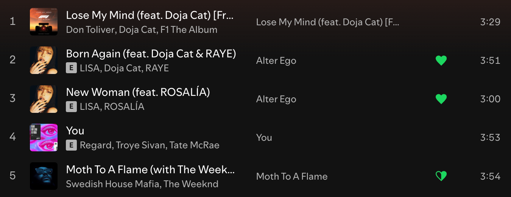

<p align="center">
    
</p>

This Spicetify extension adds back the old heart button that Spotify removed. It also shows a half-heart if you already like another version of the same track.

_Forked from Maskowh's [spicetify-old-like-button-extension](https://github.com/Maskowh/spicetify-old-like-button-extension) which is available on the Spicetify Marketplace for download - check it out!_

### CLI Installation

1. Install [Spicetify](https://spicetify.app) and follow the instructions for setup.
2. Navigate to the Spicetify config dir (`~/config/spicetify/` on Mac). If the config dir does not exist, create it by simply running `spicetify` in your shell ([source](https://spicetify.app/docs/advanced-usage/command-line-interface)).
3. Download `HeartButton.js` and place into `/Extensions`.
4. Run the following in your shell:
```bash
spicetify config extensions HeartButton.js
spicetify apply
```

### Usage

* Full heart means this track already exists in Liked Songs.
* Half-heart means a duplicate version of this track exists in Liked Songs (clicking adds the duplicate).
* Empty heart means neither this track or a duplicate version exists.

Clicking the icon adds/removes the track from Liked Songs.

### Future

* Handle local tracks
* Add button to now playing sidebar
* Add option to replace "Add to playlist" button
